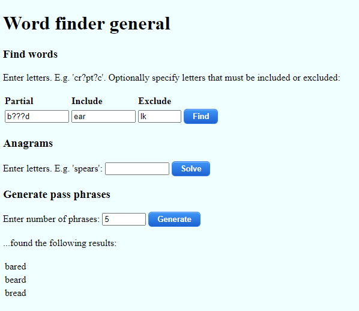

# Word Finder General

A basic word finder toolkit which provides the following functions:

- __Find words__ - Useful for solving crosswords. Put question marks for the letters you don't know. Note: output is limited to 100 words.
- __Anagrams__ - Finds anagrams based on the letters you enter.
- __Generate pass phrases__ - Randomly generate a set of passwords based on a combination of words, punctuation and numbers, which suit most password requirements, are relatively easy to remember, with fairly high entropy.

This app uses a word list from: [https://github.com/atebits/Words/](https://github.com/atebits/Words/) - thanks @atebits for curating this list and making it available.
